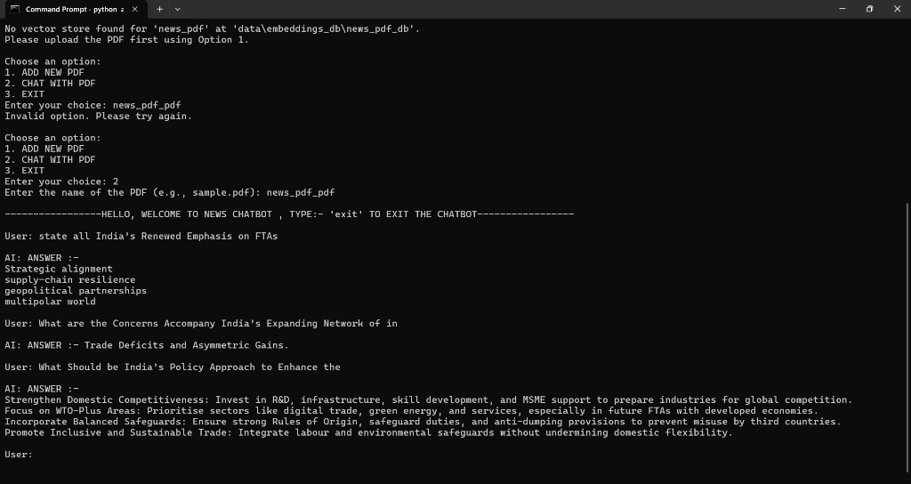

**NewsRAG AI: Revolutionizing Conversational AI**
=============================================

📖 Description
--------------

The NewsRAG AI project is an innovative conversational AI system built on top of the LLaMA (Large Language Model) architecture. This project aims to create a chatbot that can engage in natural-sounding conversations, understand user intent, and provide relevant responses. The chatbot is designed to be highly scalable, flexible, and adaptable to various applications and domains.

At its core, the NewsRAG AI project utilizes the Hugging Face Transformers library to load and fine-tune pre-trained language models. The project consists of multiple components, including a model loader, vector store manager, AI response generator, and chatbot design. These components work together seamlessly to enable the chatbot to understand and respond to user inputs.

The project has numerous applications, including but not limited to, customer service, language translation, and content generation. The NewsRAG AI project has the potential to revolutionize the way we interact with machines and can be integrated into various platforms, such as websites, mobile apps, and virtual assistants.

### Technical Overview

The NewsRAG AI project is built using Python and leverages several libraries, including Hugging Face Transformers, Langchain, and Tkinter. The project consists of multiple files, each responsible for a specific component of the chatbot. The model loader file loads pre-trained language models, while the vector store manager file handles the storage and retrieval of vector embeddings. The AI response generator file is responsible for generating responses to user inputs, and the chatbot design file integrates all the components together.

### Project Goals

The primary goal of the NewsRAG AI project is to create a conversational AI system that can engage in natural-sounding conversations with users. The project aims to achieve the following objectives:

* Develop a highly scalable and flexible chatbot architecture
* Integrate pre-trained language models for improved performance
* Implement a vector store manager for efficient storage and retrieval of vector embeddings
* Design a user-friendly interface for interacting with the chatbot

✨ Features
-----------

The NewsRAG AI project offers the following features:

1. **Conversational AI**: Engage in natural-sounding conversations with users
2. **Pre-trained Language Models**: Leverage pre-trained language models for improved performance
3. **Vector Store Manager**: Efficiently store and retrieve vector embeddings
4. **AI Response Generator**: Generate relevant responses to user inputs
5. **Chatbot Design**: Integrate all components together for a seamless user experience
6. **Scalability**: Highly scalable architecture for large-scale applications
7. **Flexibility**: Adaptable to various applications and domains
8. **User-Friendly Interface**: Intuitive interface for interacting with the chatbot
9. **PDF Loader**: Load and process PDF files for conversational AI applications
10. **Langchain Integration**: Leverage the Langchain library for improved performance and scalability

🧰 Tech Stack Table
-------------------

| Component | Technology                                                                        |
| --------- | --------------------------------------------------------------------------------- |
| Frontend  | Tkinter                                                                           |
| Backend   | Python, Hugging Face Transformers, Langchain                                      |
| Tools     | Hugging Face Transformers, Langchain, PyPDFLoader, RecursiveCharacterTextSplitter |

📁 Project Structure
--------------------

The NewsRAG AI project consists of the following folders and files:

* `src/`: Source code folder
  + `llm/`: Language model folder
    - `model_loader.py`: Model loader file
  + `embeddings/`: Embeddings folder
    - `vector_store.py`: Vector store manager file
  + `chat_bot/`: Chatbot folder
    - `chat_bot_design.py`: Chatbot design file
    - `AI_Response.py`: AI response generator file
  + `rag/`: Retrieval and generation folder
    - `augmentation.py`: Augmentation file
    - `retriever.py`: Retriever file
    - `generation.py`: Generation file
  + `loaders/`: Loaders folder
    - `pdf_loader.py`: PDF loader file
* `app.py`: Application file
* `README.md`: README file

⚙️ How to Run
---------------

To run the NewsRAG AI project, follow these steps:

1. **Install Dependencies**: Install the required dependencies, including Hugging Face Transformers, Langchain, and Tkinter.
2. **Set Environment Variables**: Set the environment variables, including the `VECTOR_STORE_PATH` and `LLM_REPO_ID`.
3. **Build the Project**: Build the project by running the `app.py` file.
4. **Deploy the Project**: Deploy the project to a production environment, such as a cloud platform or a containerization platform.

### Setup

To set up the project, follow these steps:

1. Clone the repository: `git clone https://github.com/vedant-kalal/RAG_NEWS_CHAT_BOT`
2. Install dependencies: `pip install -r requirements.txt`
3. Set environment variables: `export VECTOR_STORE_PATH=/path/to/vector/store` and `export LLM_REPO_ID=meta-llama/Llama-3.1-8B-Instruct`

### Environment

The project requires the following environment variables to be set:

* `VECTOR_STORE_PATH`: The path to the vector store
* `LLM_REPO_ID`: The repository ID of the language model

### Build

To build the project, run the following command:

```bash
python app.py
```

This will start the chatbot application.

### Deploy

To deploy the project, follow these steps:

1. Containerize the application using a containerization platform, such as Docker.
2. Deploy the containerized application to a cloud platform, such as AWS or Google Cloud.

🧪 Testing Instructions
-----------------------

To test the NewsRAG AI project, follow these steps:

1. **Unit Testing**: Run the unit tests for each component, including the model loader, vector store manager, AI response generator, and chatbot design.
2. **Integration Testing**: Run the integration tests to ensure that all components work together seamlessly.
3. **End-to-End Testing**: Run the end-to-end tests to ensure that the chatbot application works as expected.

### Unit Testing

To run the unit tests, follow these steps:

1. Install the required dependencies, including the `unittest` library.
2. Run the unit tests using the `unittest` library.

### Integration Testing

To run the integration tests, follow these steps:

1. Install the required dependencies, including the `pytest` library.
2. Run the integration tests using the `pytest` library.

### End-to-End Testing

To run the end-to-end tests, follow these steps:

1. Install the required dependencies, including the `selenium` library.
2. Run the end-to-end tests using the `selenium` library.

📸 Screenshots
--------------



📦 API Reference
----------------

The NewsRAG AI project provides the following API endpoints:

* `POST /chat`: Send a message to the chatbot
* `GET /conversation`: Retrieve the conversation history

### API Documentation

The API documentation is available at [API Documentation](https://example.com/api/docs).

👤 Author
---------

The NewsRAG AI project is developed and maintained by [Vedant Kalal](https://github.com/vedant-kalal).

📝 License
----------

The NewsRAG AI project is licensed under the [MIT License](https://opensource.org/licenses/MIT).
